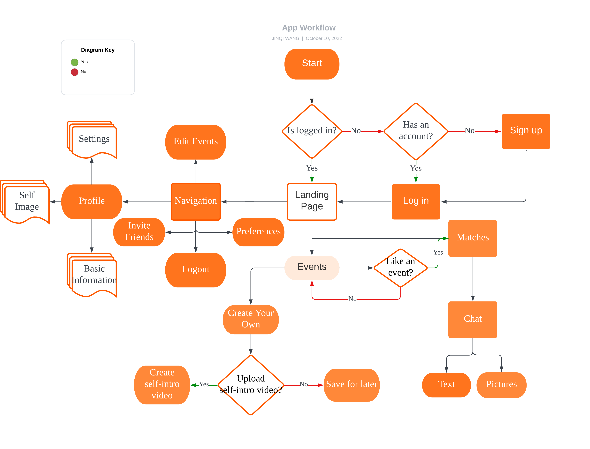

Group Members: Hao Yuan, Jinqi Wang, and Sonam Shrestha

# FLN - Friend, Lovers, or Nothing
## Purpose 

### Definitions 

    A dating and friend exploring app
    
### Category 

- Social media 
- Equitable platform 
- Dating app
- Network effect 
- Networks Graph 
- ios and android

### Background

- Why we need this app?
    - User value choice: Apps are more fixated on appearance -- we want to make it interest based or value based… but the user can make this choice 
    - Less Gamified: We want to make it more like real life because all the apps currently are very gamified.

- Conflict of Interest for current dating app: 
    - Current apps in the dating market make money by keeping the users in the app--their incentive is not to have users find love or friends--there is a conflict of interests between the consumer and business

- Addressable market size 
    - All people that are looking for potential romatic relationship, interest group.
    75 million (in 10 years)
    - Total Addressable market at launch = 413,000 (59% of adults in Seattle are single)

## Overall Description 

### User Characteristics
Someone who’s really looking for a date. Someone who’s just casually browsing wants to have a natural process of knowing and dating and then committing. 

Demographics:
- Female, male and LGBTQ
- 18+ (target audience 18- 55)
- Seattle for MVP launch 

User Stories 

- I usually add people on WeChat for some official reason. Then I would browse their friend group post(moment) to see if there common interest or topic. There’s one time I added someone on WeChat and he found out that I have a dance post, and then he told me that he loves to dance too, and we should go visit a dance club sometime. The problem is how to explore people with the same interests. My friend group is limited to people I meet on a daily routine or accidentally cross over. It would be much better if the app can provide suggestions or push notifications to me for matches. Other than that, the suggestion could base on personality, interests, and some other aspects. It would be better if you can provide some small personality tests on it; then ask the type you like.  But don’t force users to take these tests, the long register process turns people like me away. Also, give users the freedom to pick what they value the most. For me, common interests, values, and personality are more important than appearance and income.
- I like the landing page that can be vertical and horizontally scrolled. Vertical scroll to move between events and horizontally scroll for more details within the same event. The landing page picture should be occupying more than 80% of the screen and emphasized. For the self-intro video, I’d like it to be short, less than 15 sec is ideal. I’d like to be able to view, retake or delete my self-intro video. I’d like to chat with all people at the same event. During event creation, I’d like it to have more fields(2-3) to guide me through the description generation. A quick tutorial could be nice when I first visit the page. I would like a heads-up before I view the founder’s video. The video should be displayed on full screen with minimal buttons. The messages and instructions on the screen should be more active and inviting.

## Workflow diagram

# Requirements 
## Functional 
- The system shall display all available events around me
- The system shall change my profile, photo, matching priority
- The system shall push event that's meet my interests on profile
- The system shall take my video and allow retake, view, and delete
- The system shall Having a chat with them and being able to save them to a friend list or drop them. 
- The system shall store user’s profile in server.
## Non-functional 
- The system shall be easy and quick to use	
- The system shall be safe and give me sense of comfort while using, especially when -it comes to user privacy
- The system shall be aesthetically pleasing 

## Instructions

Your team's code and documentation will go here.

## Gantt Diagram 
[](https://mermaid.live/edit#pako:eNp1k1FL5DAQx7_KEBAU2sOurnp9k1sE4fYQTh-EPJhNpjVnmpQm3XMRv_tNGtdud71Q6NCZ-c1_ppM3Jp1CVrJa2BC4BTpKBLxxXSMCwCOdfLnMF4vkCzoYhHRufv6Cu879QRngXjdotMUUha_S9Ap9tP8ivqBVPnmOjuD4aet-AiEltsGDb1HqSsuhtgdtdwpDNWjJyLfx4CoIzzhQ4Zgz31v6zNkJuA44-yzGMlj1AawLKdx16sMdKZx9OyE9SZIn_drZvRZum9ZggzYAKh3EirpuO1fp-Bb1dgTDKQUB1pgNs0NfZDA7nc3yoshPr7KtWZztc5duFWnXbQsPt5CDcTX1PcIINdtBfc9grhLjR4c0JsA1YTwo7VsjNp-yStjRM2DOppiLKcbr2vbtQVcRBAeo80lz-4quldqqGnCjFEqV8zG3mI-5_5uIfKYFnIxDXuwQ4mym1ddaoYMOJf1sbesPCRPA1dcAQbpTttEvGFcpLs5gf9HH5fhTz7PLhEjbdPBwyzLWIO2vVnTJ3mIsZ7SRDXJWkqmwEr0JnHH7TqGiD-73xkpWhq7HjPVtvBALLepONKyshPH4_g-WaB1s)

Link to image:
https://github.com/CS5520-MobileAppsSeattle/final-project-fln/issues/36#issue-1447340231

## Traceability Matrix  
| Requirements  | Completion Status |
| ------------- | ------------- |
| The system shall display all available events around me  | Met  |
| The system shall change my profile, photo, interests  | Met  |
| The system shall take my video and allow retake, view, and delete  | Met  |
| The system shall show me the applications to the events that I created and allow me to connect with them in chat| Met | 
| The system shall Having a chat with them and being able to save them to a friend list or drop them.   | Met  |
| The system shall store user’s profile in server  | Met  |

